<div align="center">

# 🎓 Course Booking System

A full-featured **Learning Management Platform** built with Laravel 12 — manage courses, students, enrollments, and users through an intuitive admin dashboard with bilingual support.


</div>

---

## Features

- **Full CRUD** for Courses, Students, Bookings, and Users (admin)
- **Soft Deletes & Recycle Bin** — recover deleted records across all modules
- **Real-time AJAX Search** with keyword highlighting across every listing
- **Role-based Access** — Admins see everything; regular users see only their own data (`OwnedByUser` trait)
- **Bilingual UI** — English (LTR) & Arabic (RTL) with session-based language switching
- **Auth System** — Registration, login, email verification, password reset (Laravel Breeze)
- **Image Uploads** — Student profile pictures with UUID naming
- **Dashboard Analytics** — Counts for courses, students, bookings (+ users for admins)
- **Responsive Dark Theme** — Mobile-friendly design with TailwindCSS
- **Policy Authorization** — Every controller action is policy-protected

---

## Screenshots

### Landing & Auth

|                Landing Page                 |                  Login                  |                   Register                    |
| :-----------------------------------------: | :-------------------------------------: | :-------------------------------------------: |
|  | 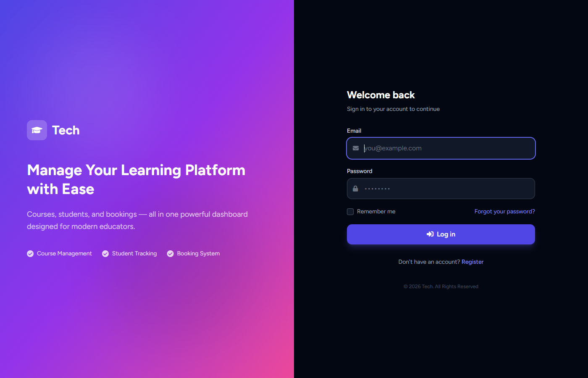 | 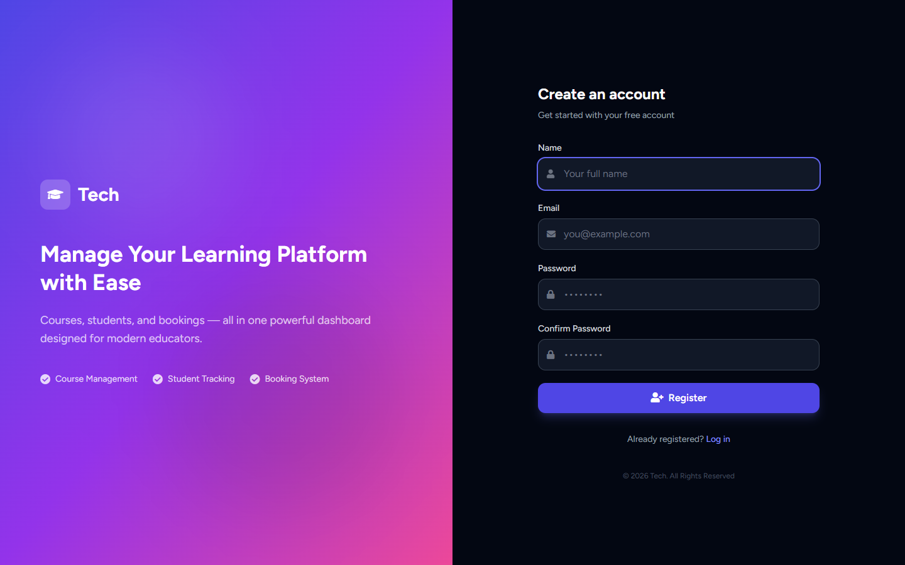 |

### Dashboard

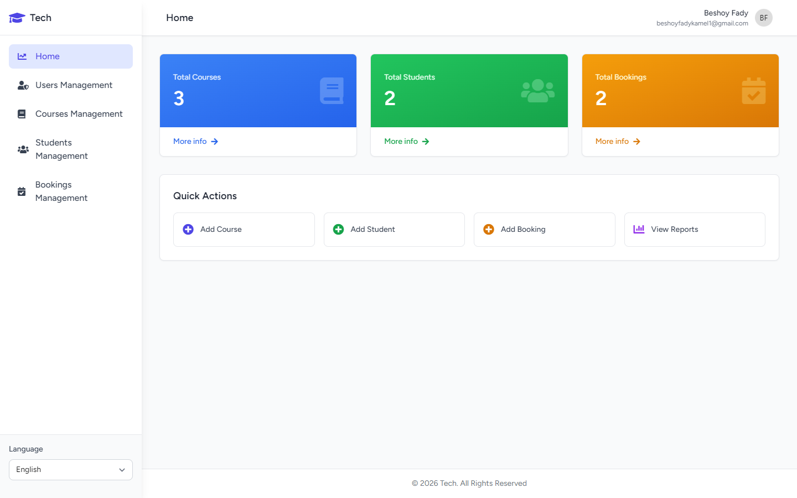

### Courses

|                   List                   |                   Create                    |                   Details                    |
| :--------------------------------------: | :-----------------------------------------: | :------------------------------------------: |
| 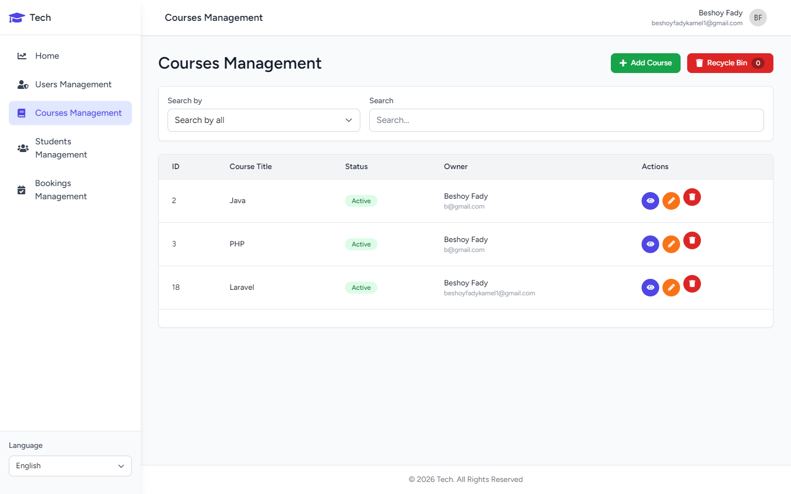 | 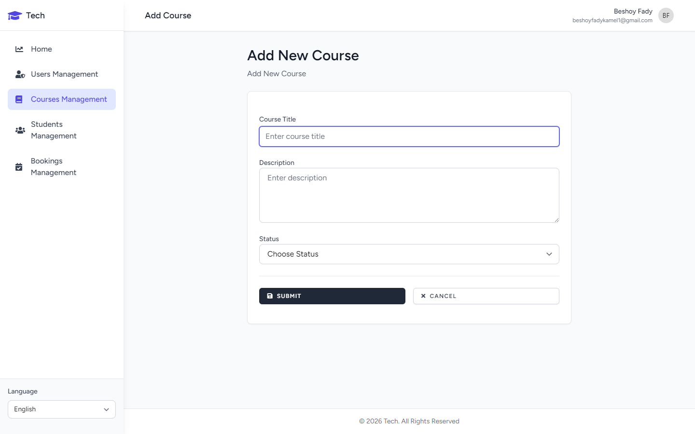 | 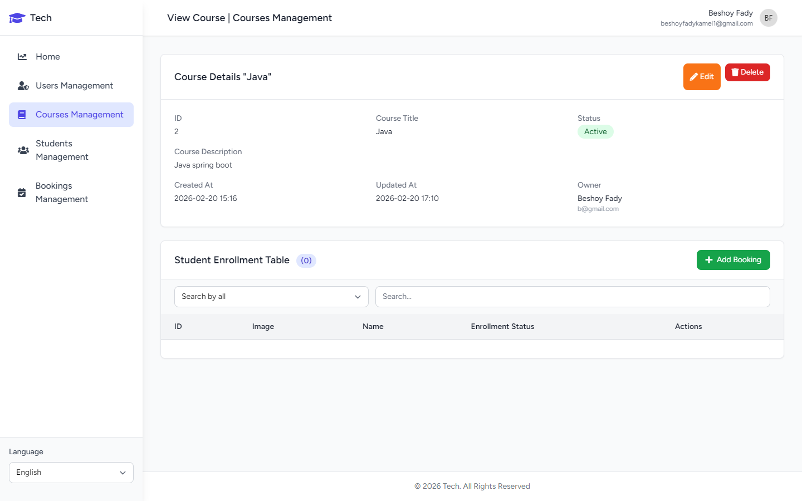 |

### Students

|                   List                    |                    Create                    |                    Profile                    |
| :---------------------------------------: | :------------------------------------------: | :-------------------------------------------: |
| 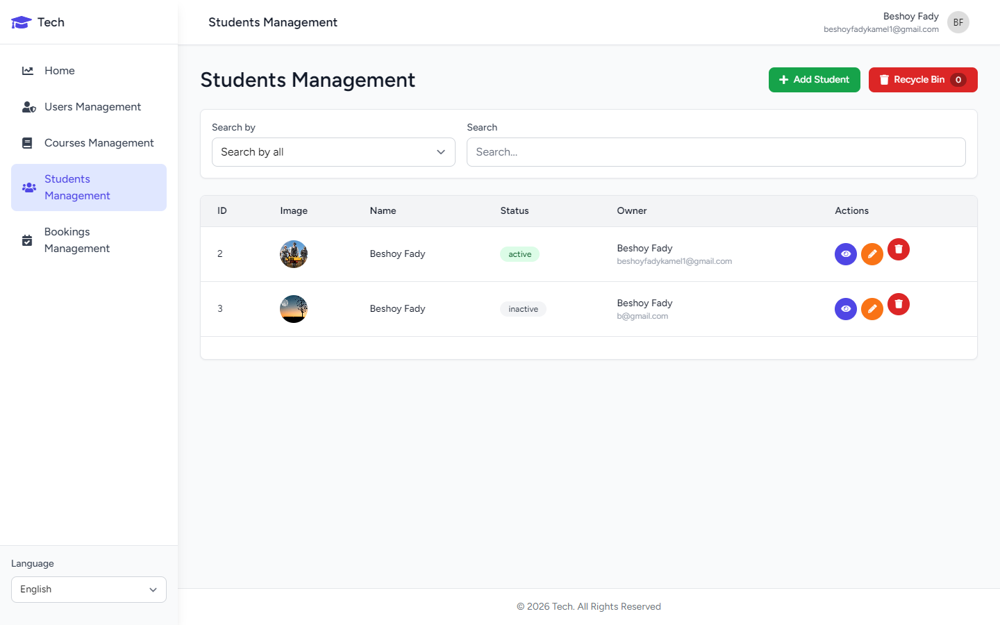 | 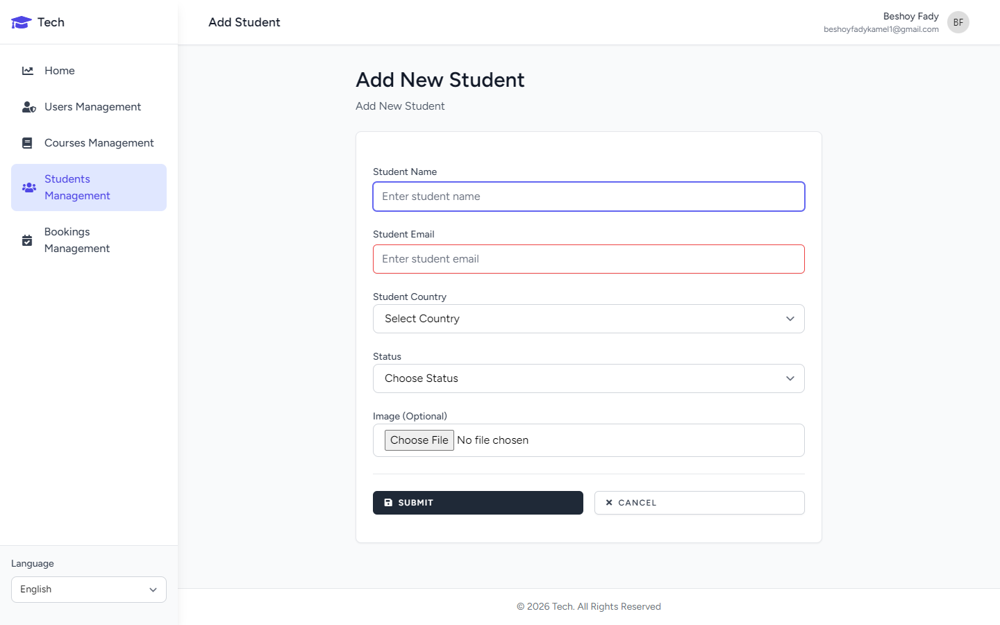 | 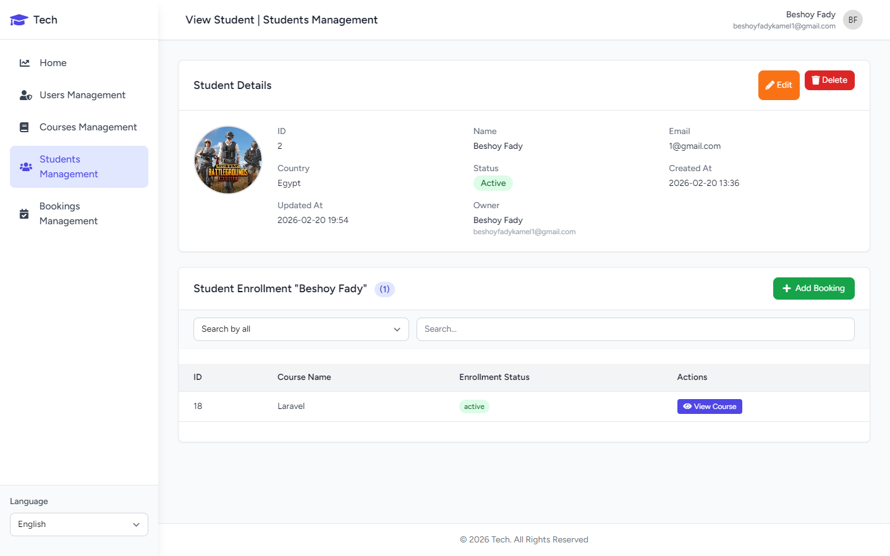 |

### Bookings

|                   List                    |                    Create                    |                    Details                    |
| :---------------------------------------: | :------------------------------------------: | :-------------------------------------------: |
|  | 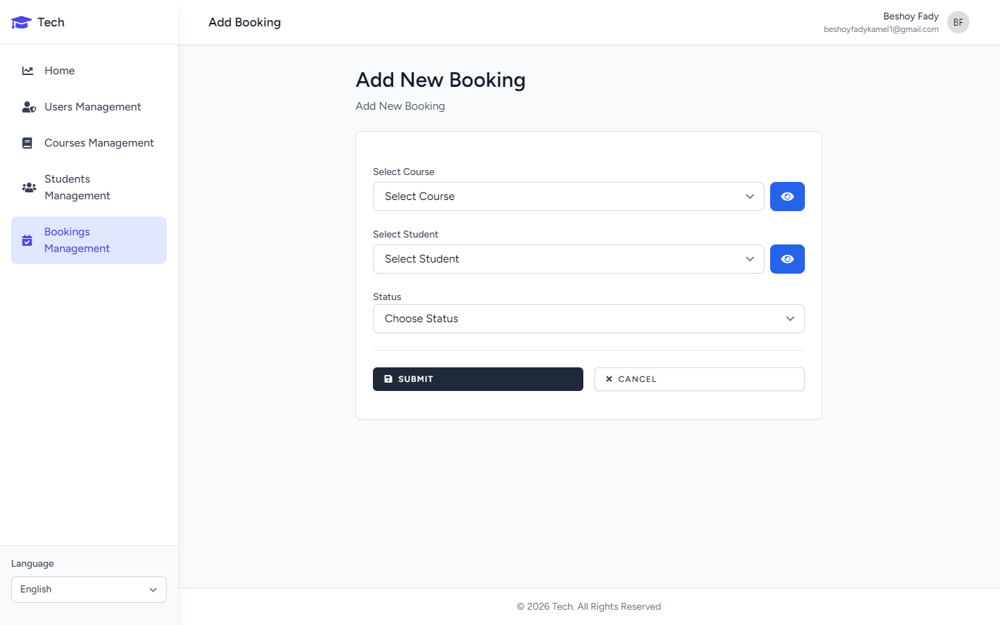 | 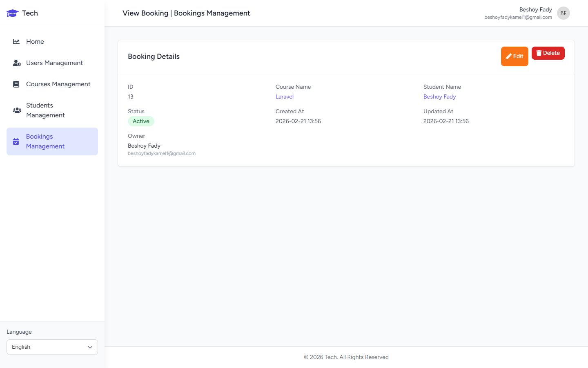 |

### Users & Profile (Admin)

|               Users List                |                Profile                 |                Course Archive                 |                Student Archive                 |
| :-------------------------------------: | :------------------------------------: | :-------------------------------------------: | :--------------------------------------------: |
| 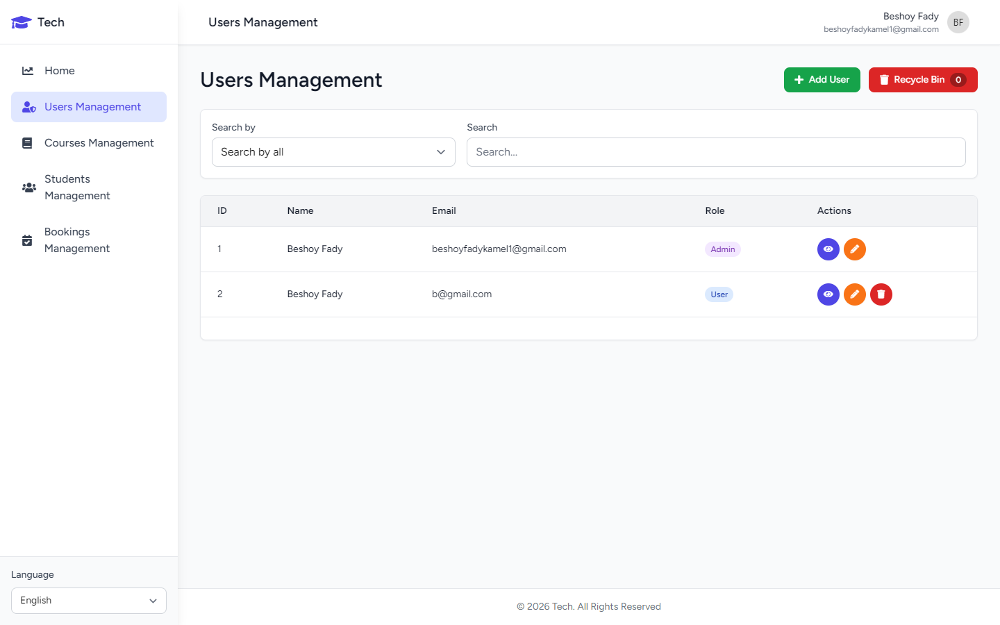 | 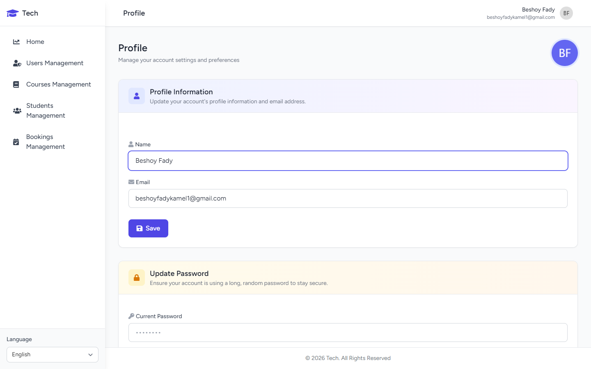 | 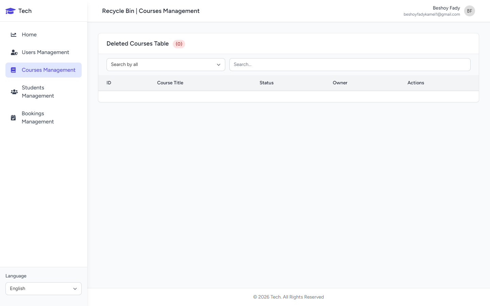 | 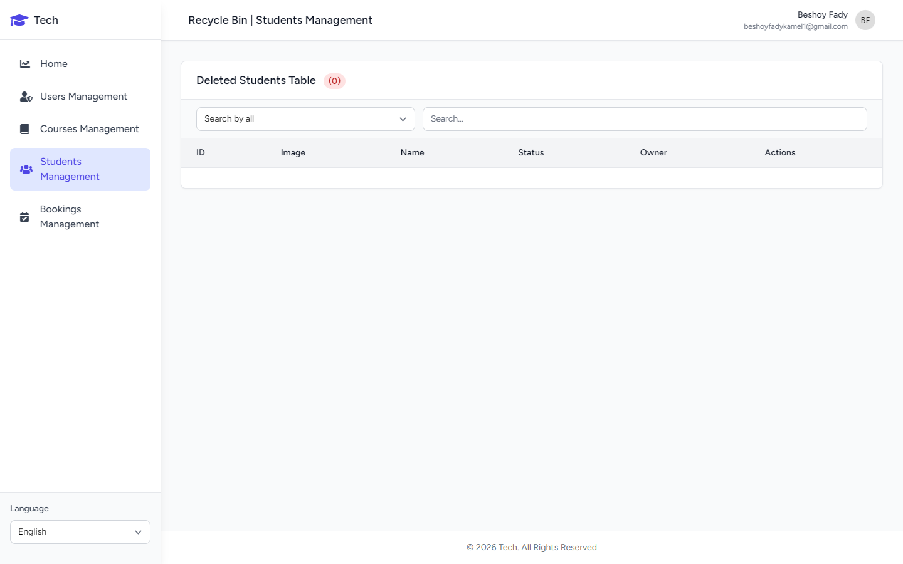 |

---

## Tech Stack

| Layer    | Technology                                          |
| :------- | :-------------------------------------------------- |
| Backend  | Laravel 12, PHP 8.2+                                |
| Database | MySQL 8, Eloquent ORM                               |
| Frontend | TailwindCSS 3, Alpine.js 3, Axios                   |
| Auth     | Laravel Breeze (email verification, password reset) |
| Build    | Vite                                                |
| Testing  | PHPUnit                                             |

---

## Database Schema

```
users ──────< courses
  │              │
  │              │ (via bookings pivot)
  │              │
  ├────────< students >────── countries
  │              │
  │         bookings
  │    (student_id + course_id UNIQUE)
  └──────────< bookings
```

| Table         | Key Columns                                     | Notes                                                  |
| :------------ | :---------------------------------------------- | :----------------------------------------------------- |
| **users**     | name, email, password, role                     | Soft deletes, `admin` / `user` roles                   |
| **courses**   | user_id, title, description, status             | Belongs to creator, soft deletes                       |
| **students**  | user_id, name, email, image, country_id, status | Image upload, soft deletes                             |
| **bookings**  | user_id, student_id, course_id, status          | Pivot model, composite unique constraint, soft deletes |
| **countries** | name                                            | Reference table for students                           |

All foreign keys cascade on delete. All core tables support soft delete recovery.

---

## Project Structure

```
app/
├── Models/          # User, Course, Student, Booking, Country + OwnedByUser trait
├── Http/
│   ├── Controllers/ # HomeController, CourseController, StudentController,
│   │                # BookingController, ProfileController, Admin/UserController
│   ├── Middleware/   # RoleMiddleware, SetLocale
│   └── Requests/    # Form request validation classes
├── Policies/        # CoursePolicy, StudentPolicy, BookingPolicy, UserPolicy
└── Helpers/         # highlight() search-term helper

resources/views/
├── layouts/         # master.blade.php (sidebar), guest.blade.php (auth)
├── courses/         # index, create, edit, view, recycle + partials
├── students/        # index, create, edit, view, recycle + partials
├── bookings/        # index, create, edit, view, recycle + partials
├── users/           # index, create, edit, view, recycle + partials (admin)
├── profile/         # edit + partials (info, password, delete account)
└── auth/            # login, register, forgot/reset password, verify email

lang/
├── en/              # English translations
└── ar/              # Arabic translations (full RTL support)
```

---

## Routes

| Group     | Prefix                | Middleware       | Description                                           |
| :-------- | :-------------------- | :--------------- | :---------------------------------------------------- |
| Public    | `/`                   | —                | Landing page, language switch                         |
| Auth      | `/login`, `/register` | guest            | Authentication flows                                  |
| Dashboard | `/home`               | auth             | Statistics dashboard                                  |
| Courses   | `/courses`            | auth             | Full CRUD + archive + AJAX search + enrollment search |
| Students  | `/students`           | auth             | Full CRUD + archive + AJAX search + enrollment search |
| Bookings  | `/bookings`           | auth             | Full CRUD + archive + AJAX search                     |
| Users     | `/users`              | auth, role:admin | Full CRUD + archive + AJAX search                     |
| Profile   | `/profile`            | auth             | Edit profile, change password, delete account         |

---

## Installation

```bash
# Clone & install
git clone https://github.com/your-username/course-booking-system.git
cd course-booking-system
composer install
npm install

# Environment
cp .env.example .env
php artisan key:generate
# Configure DB_DATABASE, DB_USERNAME, DB_PASSWORD in .env

# Database
php artisan migrate
php artisan db:seed

# Run
npm run dev          # Vite dev server
php artisan serve    # Laravel server → http://127.0.0.1:8000
```

### Create Admin User

```bash
php artisan tinker
>>> User::create(['name'=>'Admin', 'email'=>'admin@example.com', 'password'=>bcrypt('password'), 'role'=>'admin', 'email_verified_at'=>now()]);
```

---

## Commands

```bash
php artisan serve                 # Start dev server
npm run dev                       # Vite dev server
npm run build                     # Production build
php artisan migrate:fresh --seed  # Reset & seed database
php artisan test                  # Run tests
./vendor/bin/pint                 # Code formatting (PSR-12)
```

---

## License

Open-sourced under the [MIT License](LICENSE).
