<div align="center">

# 🎓 Course Booking System

A full-featured **Learning Management Platform** built with Laravel 12 for managing courses, students, and bookings with a modern, responsive UI.


</div>

---

## 📸 Screenshots

### Landing Page
> Modern dark-themed landing page with hero section and feature highlights.


### Authentication
> Secure login & registration with a sleek dark UI powered by Laravel Breeze.


### Dashboard
> Overview dashboard with real-time statistics cards for courses, students, and bookings.

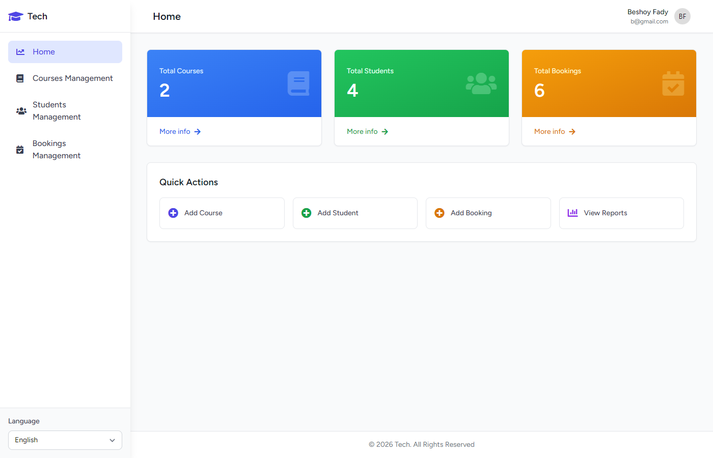

### Courses Management
> Full CRUD operations with search, pagination, and status management.

| Courses List | Create Course | Course Detail |
|:---:|:---:|:---:|
| 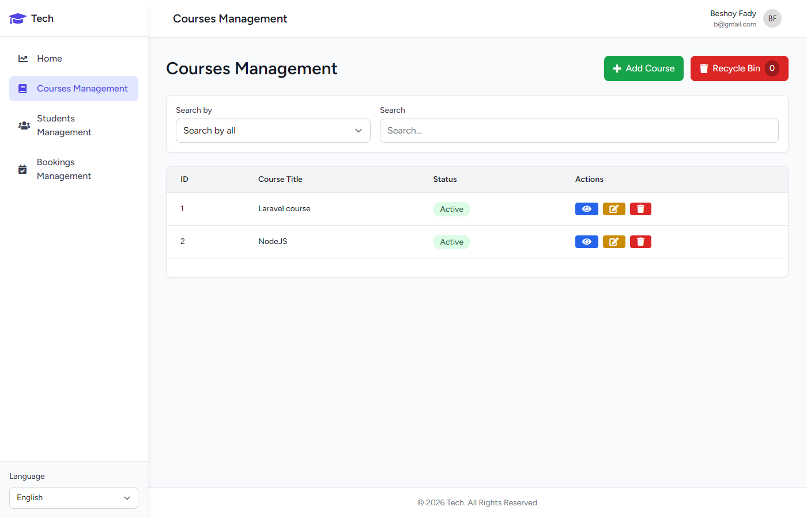 | 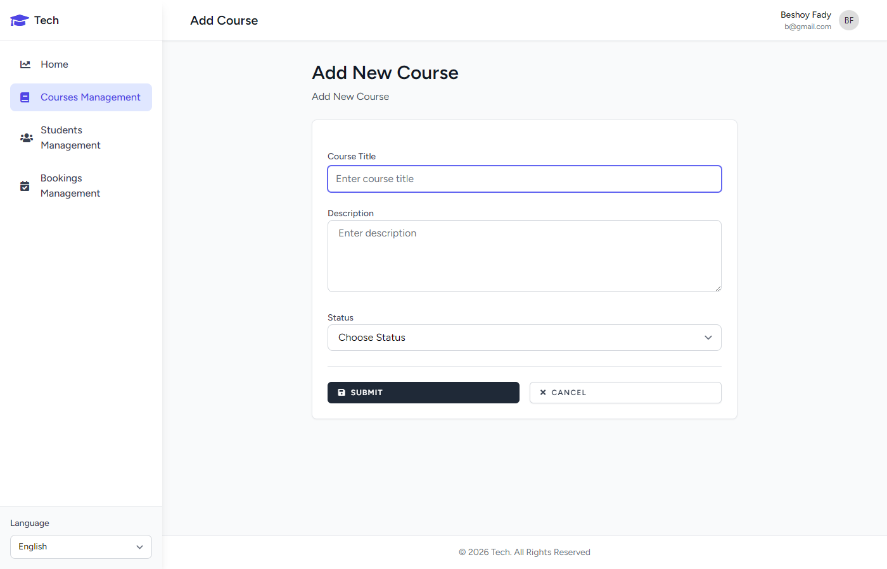 | 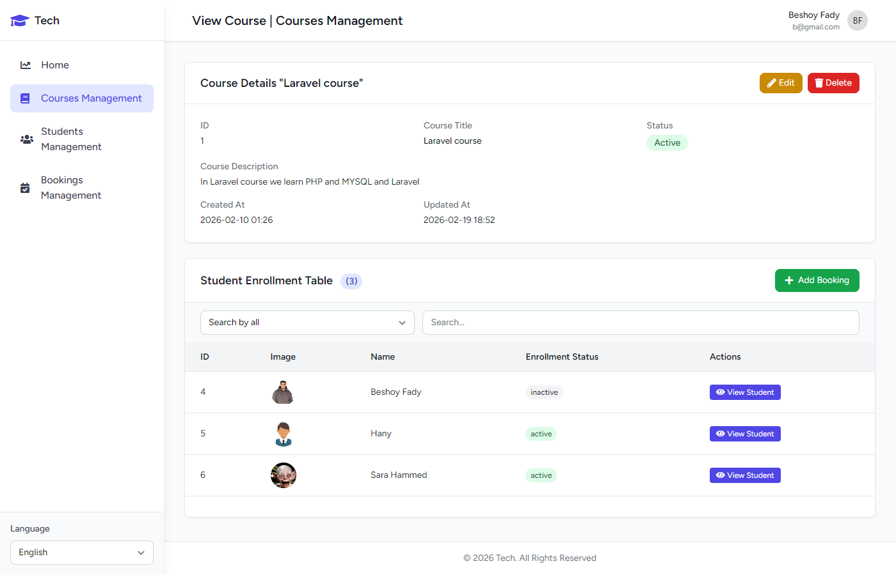 |

### Students Management
> Student profiles with image uploads, country association, and enrollment tracking.

| Students List | Create Student | Student Detail |
|:---:|:---:|:---:|
| 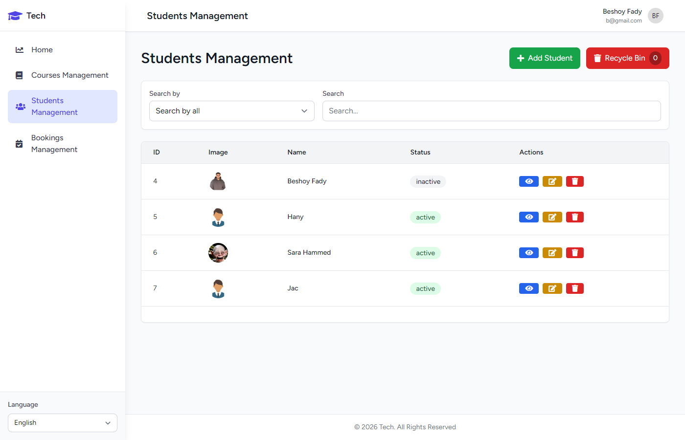 | 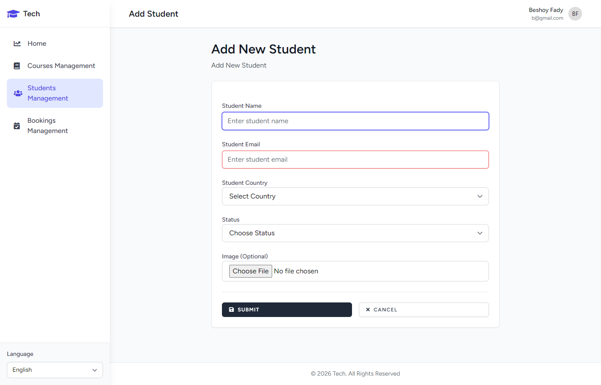 | 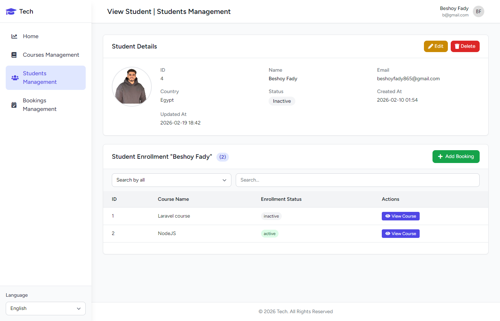 |

### Bookings Management
> Enroll students in courses with status tracking and management tools.

| Bookings List | Create Booking |
|:---:|:---:|
| 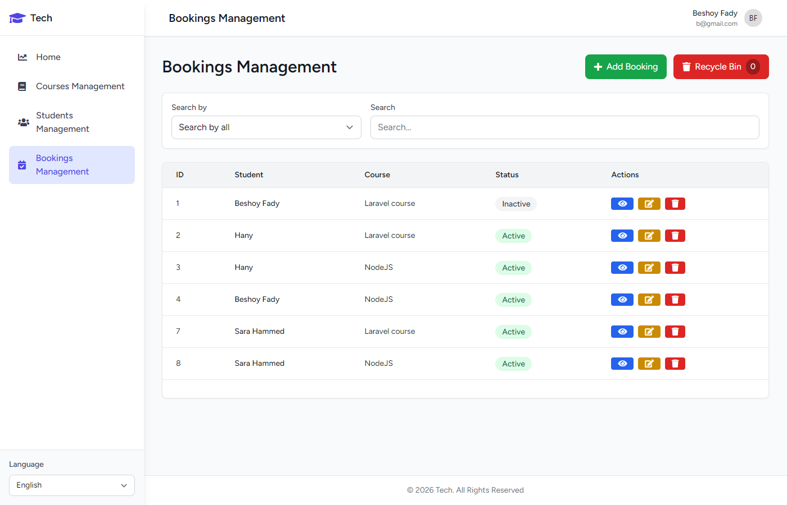 | 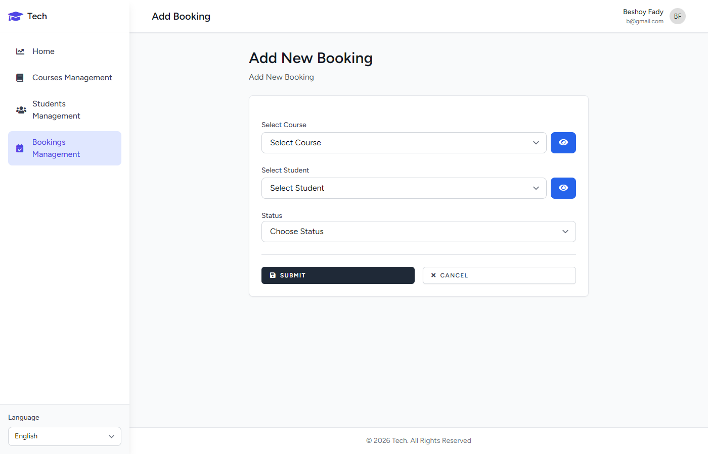 |

### Recycle Bin & Profile
> Soft-deleted records can be restored or permanently deleted. User profile management.

| Recycle Bin | Profile Settings |
|:---:|:---:|
| 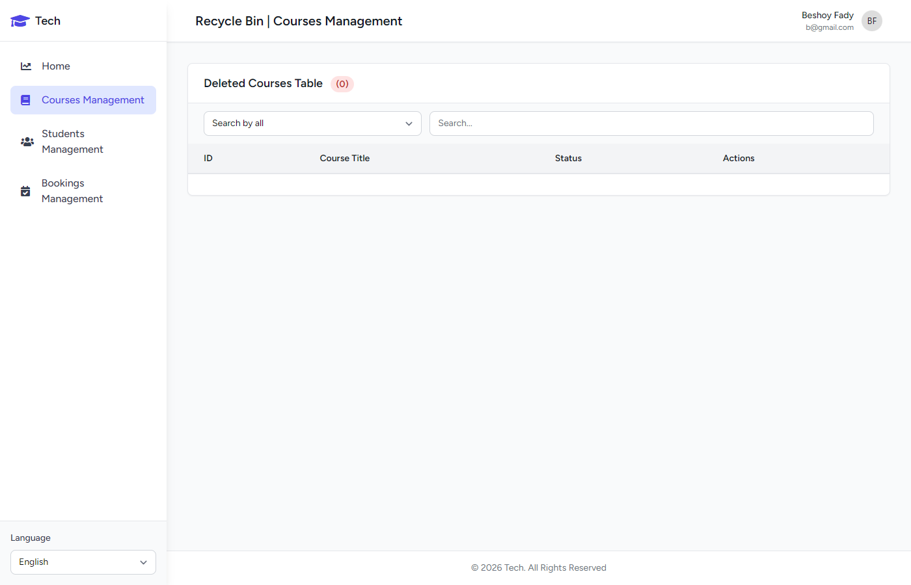 | 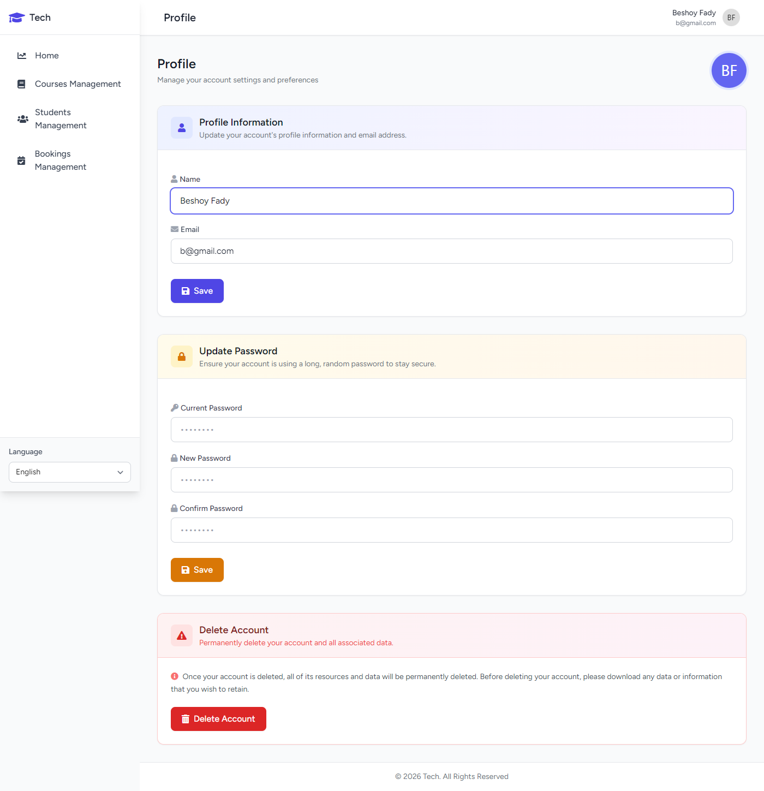 |

---

## ✨ Features

### 🔐 Authentication & Security
- User registration & login (Laravel Breeze)
- Password reset via email
- Email verification
- Profile management (update name, email, password)
- Account deletion with password confirmation
- CSRF protection on all forms

### 📚 Courses Management
- Create, read, update, and delete courses
- Course status management (Active / Inactive)
- View enrolled students per course
- AJAX-powered live search (by title, ID, or status)
- Paginated course listings
- Soft delete with recycle bin
- Restore or permanently delete courses

### 👨‍🎓 Students Management
- Full CRUD for student profiles
- Student image upload support
- Country-based student organization
- View enrolled courses per student
- AJAX-powered live search (by name, ID, email, or status)
- Paginated student listings
- Soft delete with recycle bin
- Restore or permanently delete students

### 📅 Bookings Management
- Enroll students in courses
- Booking status tracking (Active / Inactive)
- Unique student-course enrollment constraint
- AJAX-powered live search
- Paginated booking listings
- Soft delete with recycle bin
- Restore or permanently delete bookings

### 🌐 Internationalization (i18n)
- Full **Arabic** (RTL) and **English** (LTR) support
- Dynamic language switching from the sidebar
- All UI labels, messages, and validations are fully translated
- Automatic RTL/LTR layout direction

### 🔍 Advanced Search
- Real-time AJAX search across all modules
- Search by specific fields or all fields at once
- Search term highlighting in results
- Enrollment search within course/student detail pages

### ♻️ Recycle Bin
- Soft delete support across courses, students, and bookings
- Browse deleted records separately
- Restore individual records
- Permanent deletion option
- Search within recycle bin

### 📱 Responsive Design
- Fully responsive layout (mobile, tablet, desktop)
- Collapsible sidebar with mobile overlay
- Modern UI with Tailwind CSS utility classes
- Smooth transitions and hover effects
- Gradient-styled dashboard cards

---

## 🏗️ Tech Stack

| Technology | Purpose |
|:---|:---|
| **Laravel 12** | Backend PHP framework |
| **PHP 8.2** | Server-side language |
| **MySQL** | Relational database |
| **Tailwind CSS 3** | Utility-first CSS framework |
| **Alpine.js 3** | Lightweight JS framework for interactivity |
| **Laravel Breeze** | Authentication scaffolding |
| **Vite** | Frontend build tool |
| **Axios** | HTTP client for AJAX requests |
| **Font Awesome** | Icon library |
| **jQuery** | DOM manipulation & AJAX helpers |

---

## 📊 Database Schema

```
┌──────────────┐       ┌──────────────┐       ┌──────────────┐
│    users      │       │   countries   │       │   courses    │
├──────────────┤       ├──────────────┤       ├──────────────┤
│ id           │       │ id           │       │ id           │
│ name         │       │ name (unique)│       │ title        │
│ email        │       │ timestamps   │       │ description  │
│ password     │       │ soft_deletes │       │ status       │
│ timestamps   │       └──────┬───────┘       │ timestamps   │
└──────────────┘              │               │ soft_deletes │
                              │               └──────┬───────┘
                              │                      │
                    ┌─────────▼──────────┐           │
                    │     students       │           │
                    ├────────────────────┤           │
                    │ id                 │           │
                    │ name               │           │
                    │ email (unique)     │           │
                    │ image              │           │
                    │ country_id (FK)    │           │
                    │ status             │           │
                    │ timestamps         │           │
                    │ soft_deletes       │           │
                    └─────────┬──────────┘           │
                              │                      │
                              │    ┌─────────────┐   │
                              └───►│  bookings   │◄──┘
                                   ├─────────────┤
                                   │ id          │
                                   │ student_id  │
                                   │ course_id   │
                                   │ status      │
                                   │ timestamps  │
                                   │ soft_deletes│
                                   └─────────────┘
                              (unique: student_id + course_id)
```

### Relationships
- **Country** → has many **Students**
- **Student** → belongs to a **Country**
- **Student** ↔ **Course** (Many-to-Many through **Bookings** pivot table)
- **Booking** → belongs to a **Student** and a **Course**

---

## 📁 Project Structure

```
├── app/
│   ├── Helpers/
│   │   └── helpers.php              # Search term highlighting utility
│   ├── Http/
│   │   ├── Controllers/
│   │   │   ├── HomeController.php        # Dashboard with statistics
│   │   │   ├── CourseController.php      # Full CRUD + search + recycle
│   │   │   ├── StudentController.php     # Full CRUD + search + recycle
│   │   │   ├── BookingController.php     # Full CRUD + search + recycle
│   │   │   ├── ProfileController.php     # Profile management
│   │   │   └── Auth/                     # Authentication controllers
│   │   └── Requests/                     # Form request validation
│   ├── Models/
│   │   ├── User.php
│   │   ├── Course.php                    # SoftDeletes, HasFactory
│   │   ├── Student.php                   # SoftDeletes, HasFactory
│   │   ├── Booking.php                   # Pivot model with SoftDeletes
│   │   └── Country.php
│   └── View/Components/
├── resources/views/
│   ├── welcome.blade.php                 # Landing page
│   ├── home.blade.php                    # Dashboard
│   ├── layouts/
│   │   ├── master.blade.php              # Main layout (sidebar + nav)
│   │   └── guest.blade.php              # Auth pages layout
│   ├── courses/                          # index, create, edit, view, recycle
│   ├── students/                         # index, create, edit, view, recycle
│   ├── bookings/                         # index, create, edit, view, recycle
│   ├── profile/                          # edit
│   └── auth/                             # login, register, password reset, etc.
├── lang/
│   ├── en/                               # English translations
│   └── ar/                               # Arabic translations
├── database/
│   ├── migrations/                       # All table migrations
│   ├── factories/                        # Model factories for testing
│   └── seeders/                          # Database seeders
└── routes/
    ├── web.php                           # Application routes
    └── auth.php                          # Authentication routes
```

---

## 🚀 Getting Started

### Prerequisites

- **PHP** >= 8.2
- **Composer** >= 2.x
- **Node.js** >= 18.x & **npm**
- **MySQL** >= 8.0

### Installation

1. **Clone the repository**
   ```bash
   git clone https://github.com/your-username/course-booking-system.git
   cd course-booking-system
   ```

2. **Install dependencies**
   ```bash
   composer install
   npm install
   ```

3. **Environment setup**
   ```bash
   cp .env.example .env
   php artisan key:generate
   ```

4. **Configure your database** in `.env`
   ```env
   DB_CONNECTION=mysql
   DB_HOST=127.0.0.1
   DB_PORT=3306
   DB_DATABASE=course_booking
   DB_USERNAME=root
   DB_PASSWORD=your_password
   ```

5. **Run migrations and seeders**
   ```bash
   php artisan migrate --seed
   ```

6. **Build frontend assets**
   ```bash
   npm run build
   ```

7. **Start the development server**
   ```bash
   php artisan serve
   ```

   Or use the all-in-one dev command:
   ```bash
   composer dev
   ```

8. **Access the application** at `http://127.0.0.1:8000`

---

## 🧪 Testing

```bash
php artisan test
```

Or via Composer:
```bash
composer test
```

---

## 📜 Available Scripts

| Command | Description |
|:---|:---|
| `composer setup` | Full project setup (install, migrate, build) |
| `composer dev` | Start server, queue worker, and Vite concurrently |
| `composer test` | Run the test suite |
| `npm run dev` | Start Vite dev server |
| `npm run build` | Build production assets |

---

## 🗺️ API Routes Overview

| Method | URI | Description |
|:---|:---|:---|
| `GET` | `/` | Landing page |
| `GET` | `/login` | Login form |
| `POST` | `/login` | Authenticate user |
| `GET` | `/register` | Registration form |
| `POST` | `/register` | Create account |
| `POST` | `/logout` | Logout |
| `GET` | `/home` | Dashboard |
| `GET` | `/courses` | List courses |
| `GET` | `/courses/create` | Create course form |
| `POST` | `/courses/store` | Store course |
| `GET` | `/courses/show/{id}` | Course details + enrolled students |
| `GET` | `/courses/edit/{id}` | Edit course form |
| `PUT` | `/courses/update/{id}` | Update course |
| `DELETE` | `/courses/destroy/{id}` | Soft delete course |
| `GET` | `/courses/recycle` | Recycle bin |
| `POST` | `/courses/restore/{id}` | Restore course |
| `DELETE` | `/courses/delete-permanently/{id}` | Permanent delete |
| `GET` | `/courses/search` | AJAX search |
| `GET` | `/students` | List students |
| `GET` | `/students/create` | Create student form |
| `POST` | `/students/store` | Store student |
| `GET` | `/students/show/{id}` | Student details + enrolled courses |
| `GET` | `/students/edit/{id}` | Edit student form |
| `PUT` | `/students/update/{id}` | Update student |
| `DELETE` | `/students/destroy/{id}` | Soft delete student |
| `GET` | `/students/recycle` | Recycle bin |
| `POST` | `/students/restore/{id}` | Restore student |
| `DELETE` | `/students/delete-permanently/{id}` | Permanent delete |
| `GET` | `/students/search` | AJAX search |
| `GET` | `/bookings` | List bookings |
| `GET` | `/bookings/create` | Create booking form |
| `POST` | `/bookings/store` | Store booking |
| `GET` | `/bookings/show/{id}` | Booking details |
| `GET` | `/bookings/edit/{id}` | Edit booking form |
| `PUT` | `/bookings/update/{id}` | Update booking |
| `DELETE` | `/bookings/destroy/{id}` | Soft delete booking |
| `GET` | `/bookings/recycle` | Recycle bin |
| `POST` | `/bookings/restore/{id}` | Restore booking |
| `DELETE` | `/bookings/delete-permanently/{id}` | Permanent delete |
| `GET` | `/bookings/search` | AJAX search |
| `GET` | `/profile` | Edit profile |
| `PATCH` | `/profile` | Update profile |
| `DELETE` | `/profile` | Delete account |
| `POST` | `/lang` | Switch language (AR/EN) |

---

## 🤝 Contributing

1. Fork the repository
2. Create your feature branch (`git checkout -b feature/amazing-feature`)
3. Commit your changes (`git commit -m 'Add amazing feature'`)
4. Push to the branch (`git push origin feature/amazing-feature`)
5. Open a Pull Request

---

## 👨‍💻 Author

**Beshoy Fady**

---

## 📄 License

This project is open-sourced software licensed under the [MIT License](https://opensource.org/licenses/MIT). 
