<div align="center">

# 🎓 Course Booking System

A full-featured **Learning Management Platform** built with Laravel 12 — manage courses, students, enrollments, and users with an intuitive dashboard, bilingual support (English & Arabic), and a complete RESTful API.


</div>

---

## 🚀 Features

- ✅ Full CRUD for Courses, Students, Bookings, and Users (admin-only)
- ✅ Soft Deletes & Recycle Bin for all modules
- ✅ Real-time AJAX Search with keyword highlighting
- ✅ Role-based Access Control (Admin sees all, Users see their own)
- ✅ Bilingual UI — English & Arabic with RTL support
- ✅ Authentication System — Registration, login, email verification, password reset
- ✅ Student Profile Images with UUID naming
- ✅ Dashboard Analytics — Statistics for all modules
- ✅ **RESTful API** with Laravel Sanctum (30-day token expiry)
- ✅ Unified JSON Response Format for all API endpoints
- ✅ Policy-based Authorization for all actions
- ✅ Responsive Dark Theme — Mobile-friendly TailwindCSS design

---

## 📸 Screenshots

### Landing & Authentication

|                Landing Page                 |                  Login                  |                   Register                    |
| :-----------------------------------------: | :-------------------------------------: | :-------------------------------------------: |
| 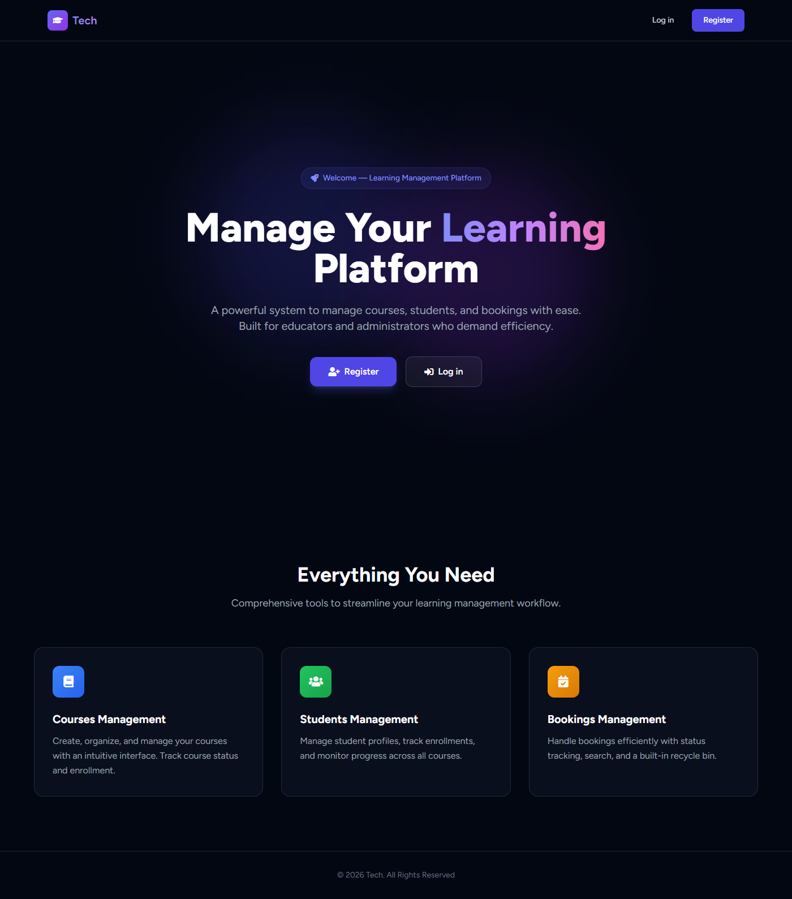 | 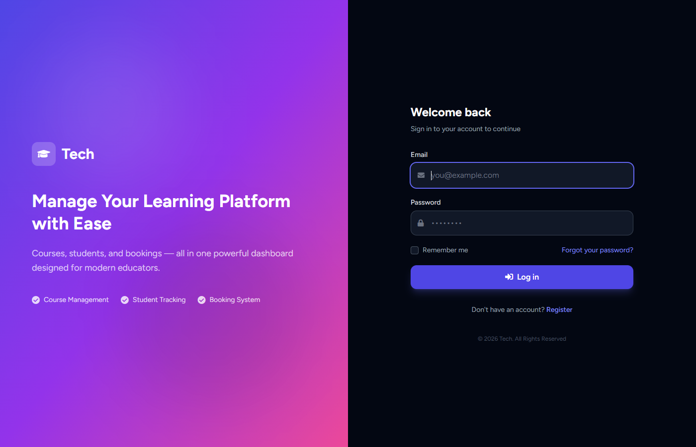 | 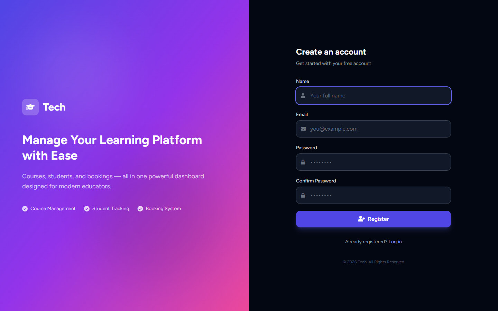 |

### Dashboard & Main Modules

|                 Dashboard                  |                   Courses                   |                   Students                    |
| :----------------------------------------: | :-----------------------------------------: | :-------------------------------------------: |
| 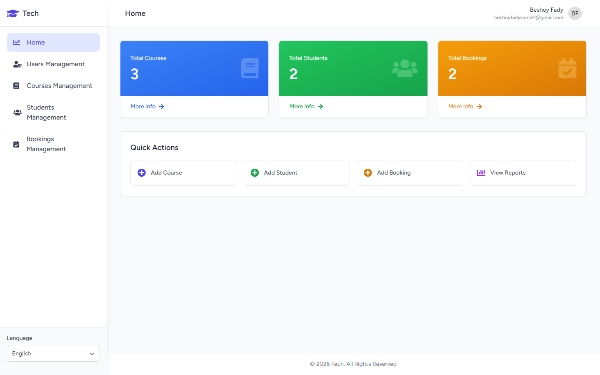 | 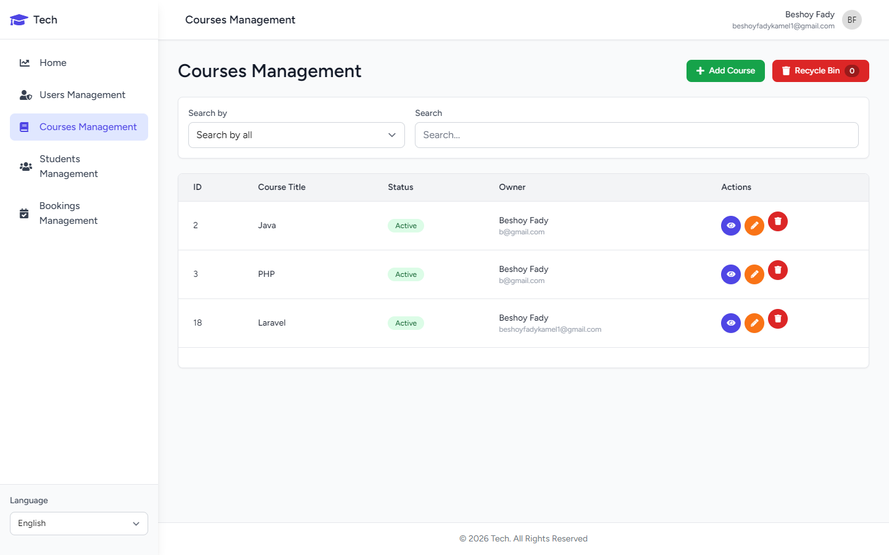 | 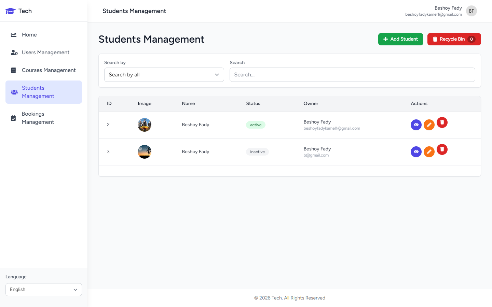 |

### CRUD Operations

|                Create Course                |                 View Course                  |                Create Booking                 |
| :-----------------------------------------: | :------------------------------------------: | :-------------------------------------------: |
| 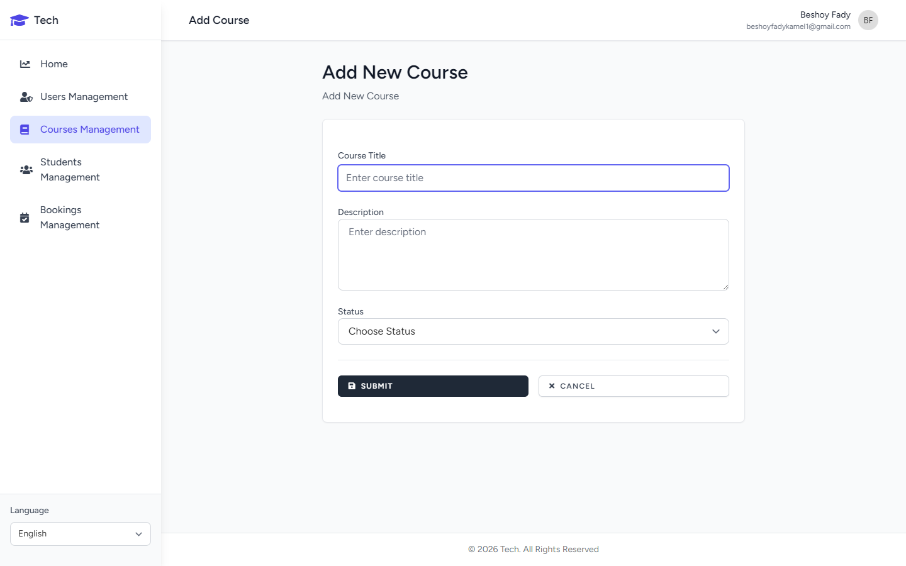 | 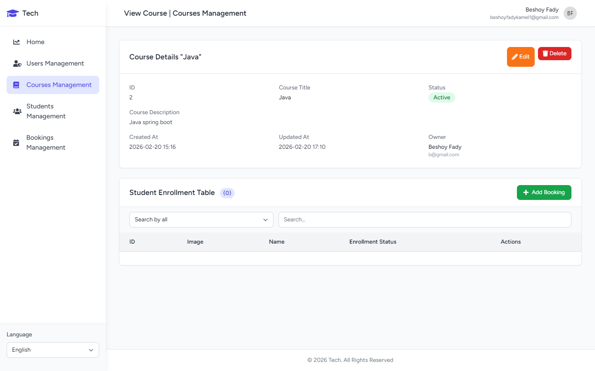 | 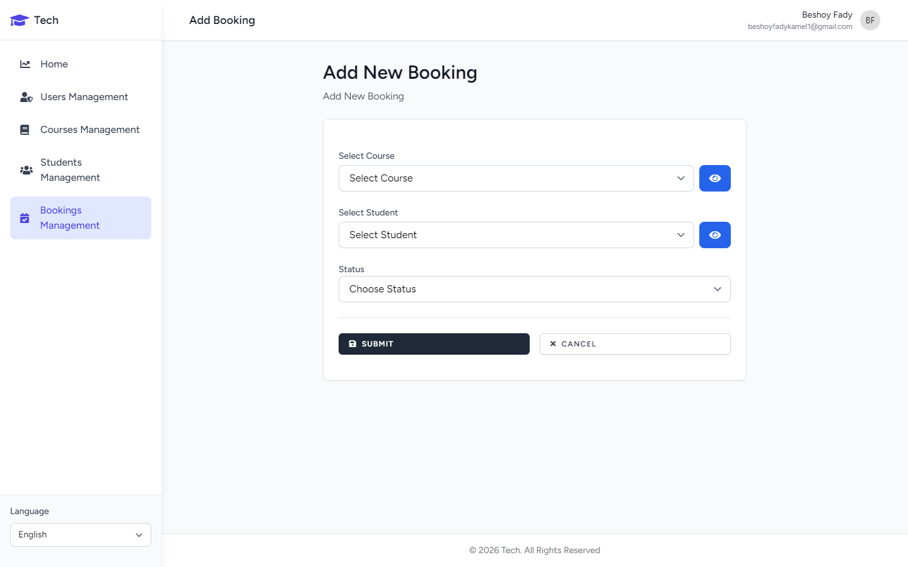 |

### Admin & User Management

|            Admin Users List             |              User Profile              |                  Recycle Bin                  |
| :-------------------------------------: | :------------------------------------: | :-------------------------------------------: |
| 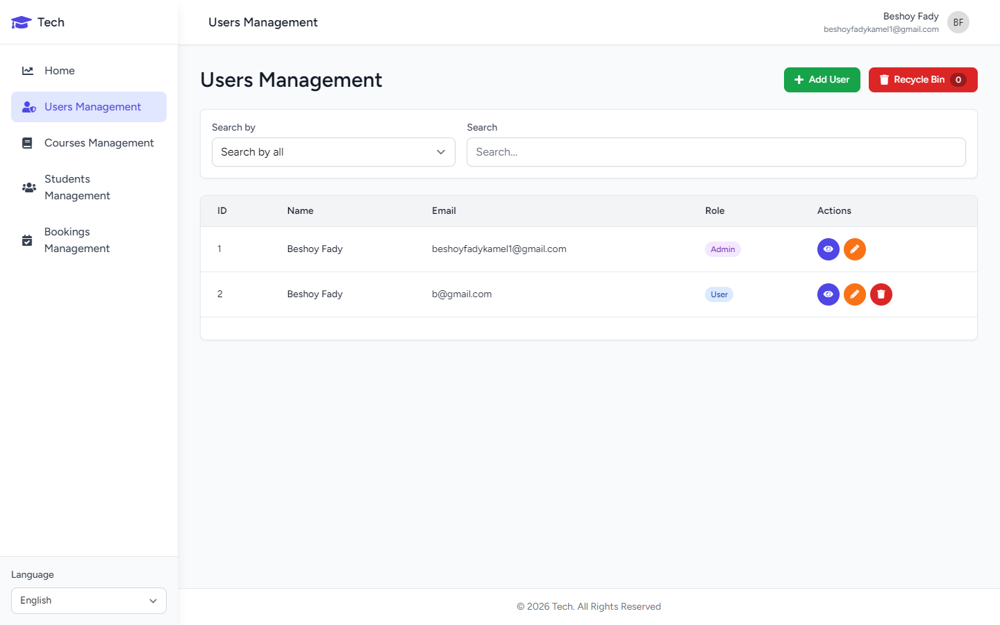 | 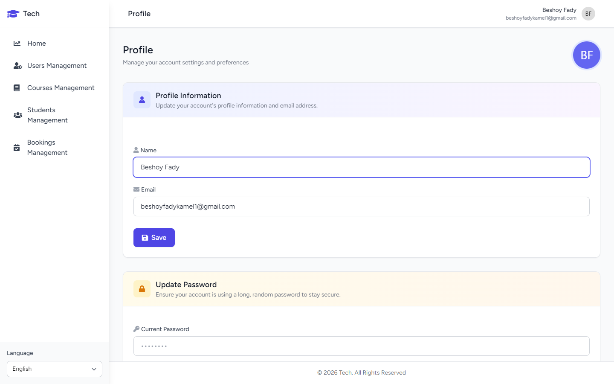 | 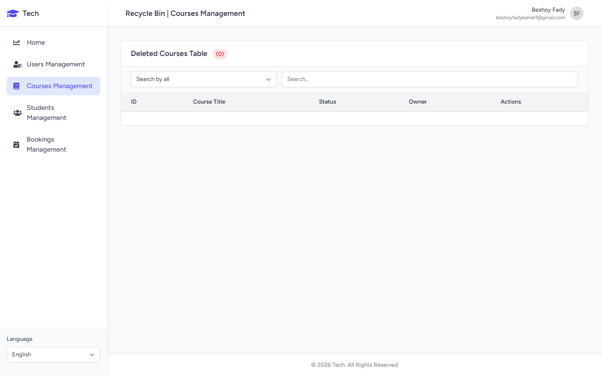 |

---

## 🛠 Tech Stack

| Component    | Technology                          |
| :----------- | :---------------------------------- |
| **Backend**  | Laravel 12, PHP 8.2+                |
| **Database** | MySQL 8, Eloquent ORM               |
| **Frontend** | TailwindCSS 3, Alpine.js 3, Axios   |
| **Auth**     | Laravel Breeze (Web), Sanctum (API) |
| **Build**    | Vite 7, PostCSS                     |
| **Testing**  | PHPUnit 11                          |

---

## 📊 Database Schema

```
users ──────────< courses
  │                  │
  ├──────────< students >────── countries
  │                  │
  └──────────< bookings >
                  (student_id + course_id UNIQUE)
```

| Table         | Purpose                                 |
| :------------ | :-------------------------------------- |
| **users**     | Admin & user accounts (soft deletes)    |
| **courses**   | Course data owned by users              |
| **students**  | Student records with images & countries |
| **bookings**  | Enrollment records (pivot model)        |
| **countries** | Reference data for student countries    |

---

## 📁 Project Structure

```
app/
  ├── Http/Controllers/      # Web & API controllers
  ├── Http/Requests/         # Form validation classes
  ├── Http/Resources/        # API response transformers
  ├── Http/Middleware/       # RoleMiddleware, SetLocale
  ├── Models/                # User, Course, Student, Booking, Country
  ├── Policies/              # Authorization policies
  ├── Traits/                # OwnedByUser, ApiResponse
  └── Helpers/               # highlight() for search

routes/
  ├── web.php               # Web application routes
  ├── api.php               # REST API routes
  └── auth.php              # Authentication routes

resources/views/
  ├── layouts/              # Master layout & auth layout
  ├── courses/              # Course pages (CRUD + recycle)
  ├── students/             # Student pages (CRUD + recycle)
  ├── bookings/             # Booking pages (CRUD + recycle)
  ├── users/                # User management (admin-only)
  └── profile/              # User profile pages

database/
  ├── migrations/           # Database schema
  ├── factories/            # Model factories for seeding
  └── seeders/              # DatabaseSeeder, CourseSeeder
```

---

## 🌐 Web Routes

| Module    | Prefix              | Middleware  | Features                      |
| :-------- | :------------------ | :---------- | :---------------------------- |
| Public    | `/`                 | —           | Landing page, language switch |
| Auth      | `/register, /login` | guest       | Breeze authentication         |
| Dashboard | `/home`             | auth        | Statistics & quick links      |
| Courses   | `/courses`          | auth        | Full CRUD + search + archive  |
| Students  | `/students`         | auth        | Full CRUD + search + archive  |
| Bookings  | `/bookings`         | auth        | Full CRUD + search + archive  |
| Users     | `/users`            | auth, admin | Admin-only user management    |
| Profile   | `/profile`          | auth        | Settings & password change    |

---

## 🔌 REST API Endpoints

**Base URL:** `/api` | **Auth:** Bearer token (30-day expiry)

### Authentication

| Method | Endpoint       | Description       |
| :----- | :------------- | :---------------- |
| POST   | `/register`    | Register new user |
| POST   | `/login`       | Login & get token |
| POST   | `/auth/logout` | Revoke token      |

### Courses API

| Method | Endpoint                | Description              |
| :----- | :---------------------- | :----------------------- |
| GET    | `/courses`              | List courses (paginated) |
| GET    | `/courses/recycle`      | List soft-deleted        |
| POST   | `/courses/store`        | Create course            |
| GET    | `/courses/{id}`         | View course              |
| PUT    | `/courses/{id}/update`  | Update course            |
| DELETE | `/courses/{id}/delete`  | Soft delete              |
| PATCH  | `/courses/{id}/restore` | Restore from trash       |
| DELETE | `/courses/{id}/force`   | Permanently delete       |

### Response Format

Every API response follows this structure:

```json
{
    "success": true,
    "code": 200,
    "message": "Human-readable message",
    "data": {
        /* resource data */
    },
    "errors": null
}
```

**Paginated Responses** include pagination metadata with `current_page`, `last_page`, `total`, and navigation `links`.

### Example: List Courses

```bash
curl -H "Authorization: Bearer {token}" \
  http://localhost:8000/api/courses
```

Response:

```json
{
    "success": true,
    "code": 200,
    "message": "Courses retrieved successfully",
    "data": {
        "courses": [
            {
                "id": 1,
                "title": "Laravel Fundamentals",
                "status": "active",
                "bookings_count": 5,
                "owner": {
                    "id": 1,
                    "name": "Admin",
                    "email": "admin@example.com"
                }
            }
        ],
        "pagination": {
            "current_page": 1,
            "last_page": 2,
            "per_page": 10,
            "total": 15,
            "links": {
                /* ... */
            }
        }
    },
    "errors": null
}
```

---

## 🔐 Authorization & Policies

| Policy          | Model   | Rules                                     |
| :-------------- | :------ | :---------------------------------------- |
| `CoursePolicy`  | Course  | Admin → all; User → own records only      |
| `StudentPolicy` | Student | Admin → all; User → own records only      |
| `BookingPolicy` | Booking | Admin → all; User → own records only      |
| `UserPolicy`    | User    | Admin-only (users can edit their profile) |

The **`OwnedByUser`** trait filters queries per role:

- **Admin:** Sees all records
- **User:** Sees only their own records

---

## 🔧 Installation

```bash
# Clone repository
git clone https://github.com/beshoyfadykamel/course-booking-system.git
cd course-booking-system

# Install dependencies
composer install
npm install

# Setup environment
cp .env.example .env
php artisan key:generate

# Configure database in .env
# DB_DATABASE=course_booking
# DB_USERNAME=root
# DB_PASSWORD=

# Run migrations & seeders
php artisan migrate
php artisan db:seed

# Start development servers
npm run dev          # Vite dev server
php artisan serve    # Laravel server → http://127.0.0.1:8000
```

### Create Admin User

```bash
php artisan tinker
>>> User::create(['name'=>'Admin', 'email'=>'admin@example.com', 'password'=>bcrypt('password'), 'role'=>'admin', 'email_verified_at'=>now()]);
```

---

## 📝 Commands

```bash
php artisan serve              # Start web server
npm run dev                    # Start Vite dev server
npm run build                  # Production build
php artisan migrate            # Run migrations
php artisan db:seed            # Run seeders
php artisan migrate:fresh --seed  # Reset & seed database
php artisan test               # Run tests
./vendor/bin/pint              # Code formatting (PSR-12)
```

---

## � Postman Collection

A complete **Postman Collection** is included for easy API testing:

📁 **Location:** `Postman/course-booking.postman_collection.json`

### Import Instructions

1. Open Postman
2. Click **Import** → **File** → Select `course-booking.postman_collection.json`
3. Set your environment variables:
    - `base_url`: `http://localhost:8000/api`
    - `token`: Your Bearer token from login

### Included Requests

- ✅ Auth endpoints (register, login, logout)
- ✅ All Courses CRUD operations
- ✅ Recycle bin operations (restore, force delete)
- ✅ Pre-configured headers & authorization

---

## 🏆 Best Practices & Architecture

This project follows Laravel & software engineering best practices:

### 🌐 RESTful API Architecture

This is a **true RESTful API**, not just a REST API, following all REST architectural principles:

- **Stateless Communication** — Every request contains authentication token; no server-side sessions
- **Resource-Based URLs** — `/courses`, `/courses/{id}` (not `/getCourse?id=1`)
- **Proper HTTP Methods** — GET (read), POST (create), PUT (update), DELETE (soft delete), PATCH (restore)
- **Standard HTTP Status Codes** — 200 (OK), 201 (Created), 401 (Unauthorized), 403 (Forbidden), 404 (Not Found), 422 (Validation Error), 500 (Server Error)
- **Uniform Interface** — Consistent JSON structure across all endpoints using `ApiResponse` trait
- **Resource Representations** — API Resources transform Eloquent models to JSON (`CourseResource`, `UserResource`)
- **HATEOAS-Ready** — Paginated responses include navigation links (`prev`, `next`, `first`, `last`)
- **Client-Server Separation** — Frontend (Blade/Alpine) and API are decoupled
- **Cacheable Responses** — Proper use of HTTP methods enables caching strategies

### 🔒 Security & Authorization

- **Policy-Based Authorization** — Every controller action protected by Laravel Policies
- **Form Request Validation** — Centralized validation with custom error messages
- **CSRF Protection** — Built-in Laravel CSRF for web routes
- **SQL Injection Prevention** — Eloquent ORM with parameter binding
- **XSS Protection** — Blade template escaping by default
- **Password Hashing** — Bcrypt hashing via Laravel
- **API Token Authentication** — Sanctum with 30-day token expiry
- **Rate Limiting** — Login throttling (5 attempts with lockout)

### 🏗 Code Architecture

- **OwnedByUser Trait** — Multi-tenancy pattern for user-owned resources (admin sees all, users see own)
- **API Resources** — Clean JSON transformations (separation of concerns)
- **ApiResponse Trait** — Consistent API response envelope across all endpoints
- **Unified Exception Handling** — Global exception renderer for API routes returns structured JSON
- **Service Layer Pattern** — Logic encapsulated in dedicated methods (`forCurrentUser`, `forApiIndex` scopes)
- **DRY Principle** — Reusable traits, middleware, and helper functions
- **Separation of Concerns** — Controllers, Requests, Resources, Policies, Models properly separated

### 🎯 Laravel Best Practices

- **Eloquent Relationships** — Proper use of `hasMany`, `belongsTo`, eager loading
- **Query Scopes** — Reusable query logic (`scopeForCurrentUser`, `scopeForApiIndex`)
- **Soft Deletes** — All core models support soft deletion & restoration
- **Database Migrations** — Version-controlled schema with proper rollback support
- **Model Factories** — Faker-based test data generation
- **Seeders** — Consistent database seeding for development
- **Route Model Binding** — Automatic model injection in controllers
- **Mass Assignment Protection** — `$fillable` properties on all models
- **Eloquent Casts** — Type casting for model attributes
- **PSR-12 Code Style** — Consistent formatting with Laravel Pint

### 🌍 Frontend & UX

- **Responsive Design** — Mobile-first TailwindCSS approach
- **Dark Theme** — Modern UI with Tailwind dark utilities
- **RTL Support** — Full Arabic language support with proper text direction
- **Session-Based i18n** — Language switching without page reload
- **AJAX Search** — Real-time search with keyword highlighting
- **Alpine.js** — Reactive components without heavy JS framework
- **Vite** — Fast HMR for development, optimized production builds

### 🧪 Testing & Quality

- **PHPUnit Tests** — Authentication & profile test suites included
- **Feature Tests** — Test user registration, login, password reset
- **Code Formatting** — Automated PSR-12 compliance with Pint
- **Type Safety** — Return type declarations on all methods
- **Validation Messages** — Localized error messages for both languages

### 📊 Database Design

- **Foreign Key Constraints** — Referential integrity with cascade deletes
- **Unique Constraints** — Prevent duplicate enrollments (`student_id + course_id`)
- **Indexes** — Optimized queries with proper indexing
- **Timestamps** — Automatic `created_at` & `updated_at` tracking
- **Soft Deletes Timestamps** — `deleted_at` for recovery
- **Normalized Schema** — 3NF compliance for data integrity

### 🚀 Performance

- **Eager Loading** — N+1 query prevention with `with()`, `load()`
- **Pagination** — All listing endpoints paginated (10 items/page)
- **Conditional Loading** — API resources use `whenLoaded()`, `whenCounted()`
- **Query Optimization** — Selective column loading (`select()`, `:id,name,email`)
- **Vite Asset Bundling** — Code splitting & tree shaking

### 📦 Code Organization

- **Modular Structure** — Clear separation: Controllers, Models, Policies, Resources, Requests
- **Middleware** — Reusable logic for roles & localization
- **Helpers** — Global functions auto-loaded via `composer.json`
- **Traits** — Shared behavior (`OwnedByUser`, `ApiResponse`)
- **Namespacing** — PSR-4 autoloading standards

---

## 📄 License

Open-sourced under the [MIT License](LICENSE).

---

<div align="center">

**Made with ❤️ using Laravel 12**

_A fully RESTful API following industry best practices_

</div>
